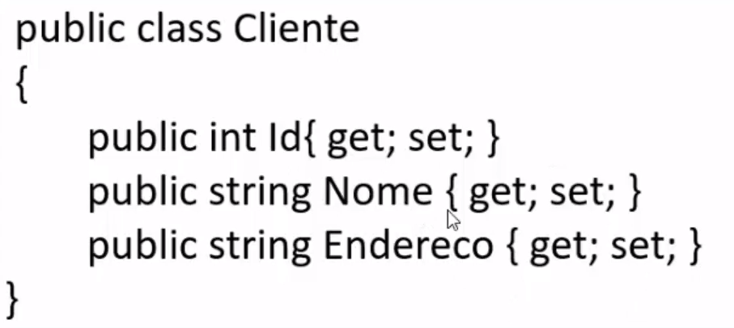
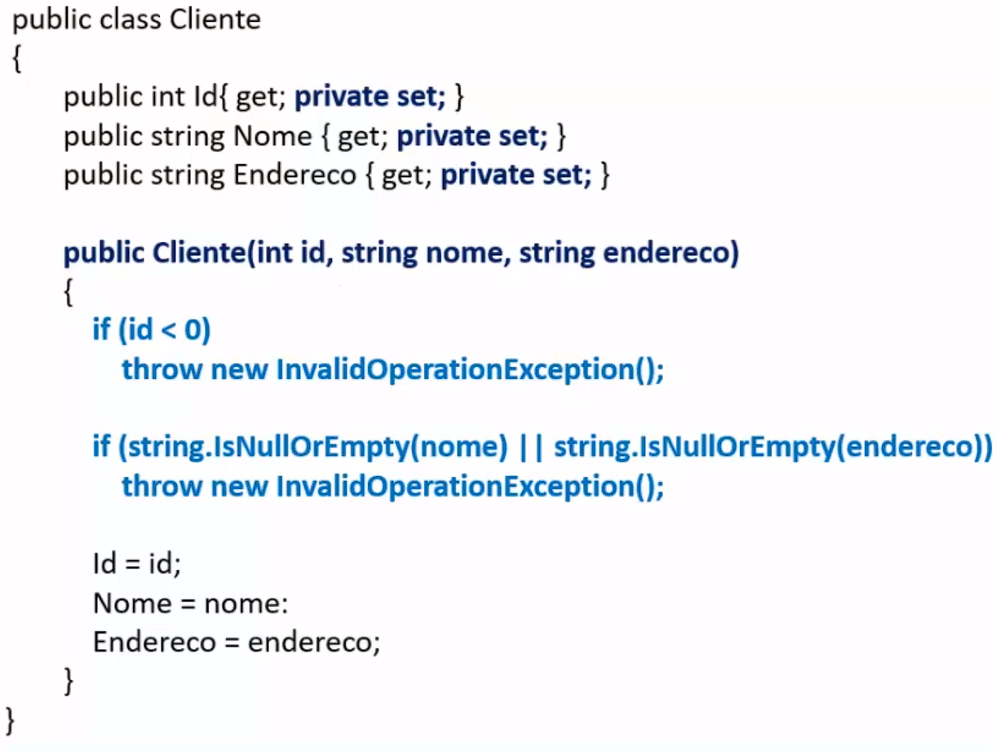
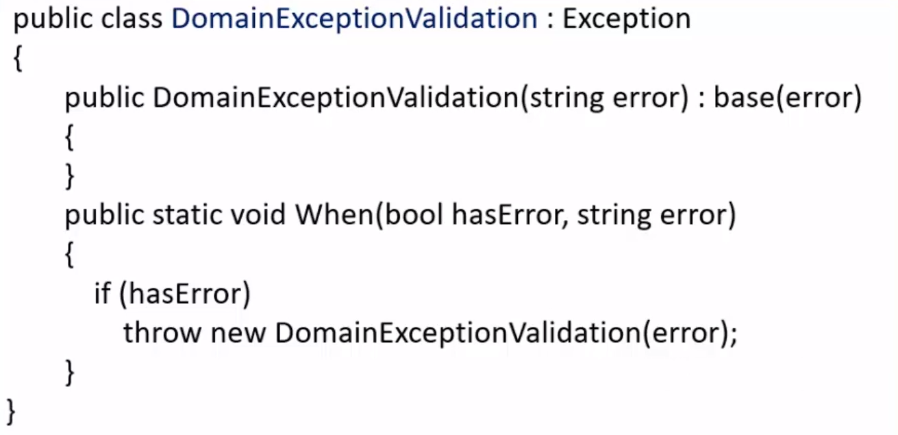
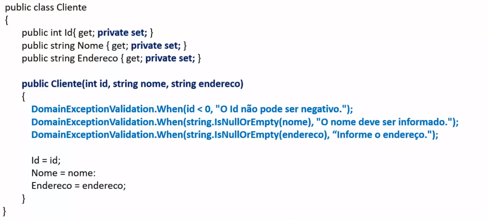

# Encapsulamento e Modelo de domínio

### Encapsulamento é ocultar os detalhes da implementação de um objeto de forma manter o seu estado consistente, uma das maneiras de implementar esse Encapsulamento é usar os modificadores de acesso para as classes, métodos e membros. Uma outra maneira é utilizar:

## Modelo de domínio

#### Que é uma representação de classes conceituais a partir do mundo real.

## Modelar o domínio

#### Entender a descrição do problema do projeto, converter os requisitos em componentes de software de uma solução.

## Para exemplificar:
#### Um cadastro de cliente, nele criarei uma classe e seus respectivos membros, como a seguir:

#### O código acima é conhecido como Modelo de domínio anêmico, que tem pontos ruins como:
#### ⚪ Violação do encapsulamento;
#### ⚪ Dificuldade na manutenção;
#### ⚪ Lógico de negócios duplicada;
#### ⚪ Estado inconsistente;
#### ⚪ Baixa coesão;
#### É um modelo sem lógica, definido apenas com propriedades com get e set públicos.

## Modelo de domínio rico

#### ⚪ Aqui utilizamos o encapsulamento para evitar a atribuição de valores inválidos às propriedades;
#### ⚪ Usamos propriedades públicas com set privados;
#### ⚪ Usamos construtores com parâmetros;
#### ⚪ Definimos condições para validação dos valores atribuídos às propriedades;

## Validação do modelo

#### Com a classe criada acima para validar as exceções, se aplicada no código apresentado no tópico anterior, será feita uma organização nas validações:
